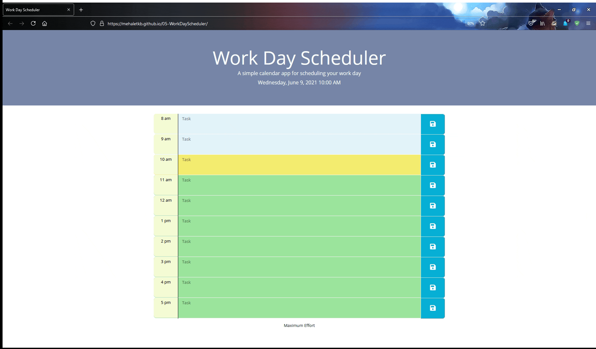

# 05-WorkDayScheduler

This week we were tasked with developping code for a day planner. 
We had to set up current date and time in the jumpotron, have persistent data pulled from local storage, and add/remove classes depending on time of day.

Here's a link: https://mehaletkb.github.io/05-WorkDayScheduler/

